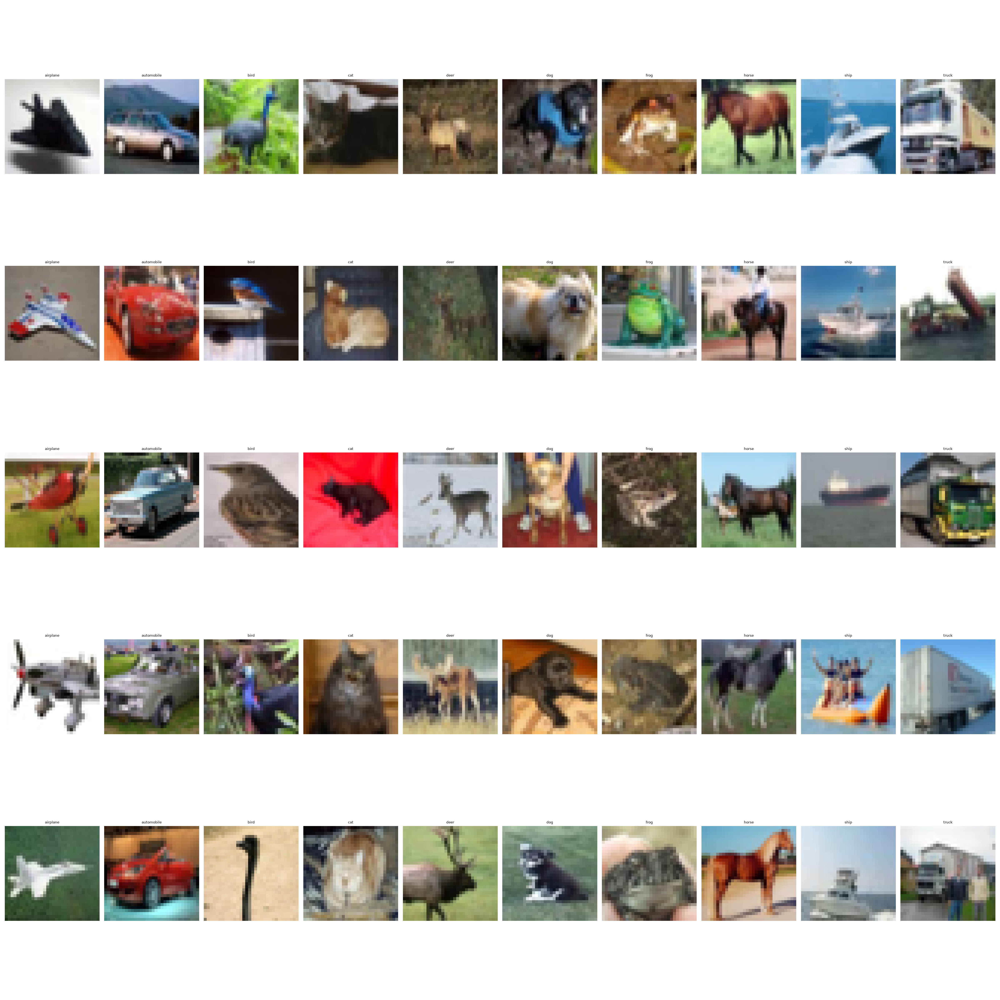
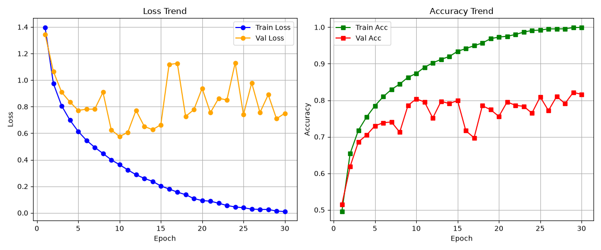
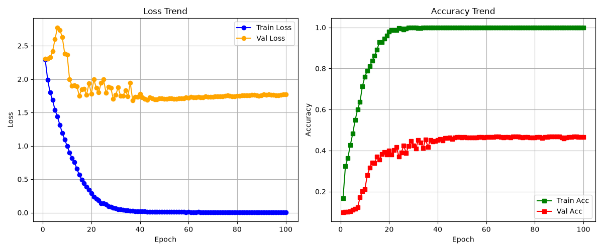

- 실험 노트.

> test set은 2026-XX-XX (Day 5)에 최초 1회만 열었습니다.
> 그 이전의 모든 판단은 val set만으로 내렸습니다.
## 1. 데이터 불러오기

### 1). 이미지 격자
- img / cifar10_samples.png



### 2). 정규화
> [결과]
> 유사한 값을 갖는다. 
> CIFAR10_MEAN = (0.4914, 0.4822, 0.4465)
> CIFAR10_STD  = (0.2470, 0.2435, 0.2616)
> 계산한 Mean : 0.4917, 0.4823, 0.4467
> 계산한 Std : 0.2471, 0.2435, 0.2616


### 3). DataLoader 


> [결과]
 x.shape : torch.Size([128, 3, 32, 32])
 x.dtype : torch.float32
 x.min   : -1.0000
 x.max   : 1.0000
 y[:10]  : tensor([4, 0, 7, 9, 7, 8, 5, 4, 8, 0])

---
## 2. 모델 구현

### 1). 차원 확인 및 width 변화에 따른 파라미터 수 측정
``` python
    print(">> width 16")
    model = SmallCNN(width=16)
    x = torch.randn(2, 3, 32, 32)
    print(model(x).shape)                                              # (2, 10) 이어야 함
    print(sum(p.numel() for p in model.parameters() if p.requires_grad))

    print(">> width 32")
    model = SmallCNN(width=32)
    x = torch.randn(2, 3, 32, 32)
    print(model(x).shape)                                              # (2, 10) 이어야 함
    print(sum(p.numel() for p in model.parameters() if p.requires_grad))

    print(">> width 64")
    model = SmallCNN(width=64)
    x = torch.randn(2, 3, 32, 32)
    print(model(x).shape)                                              # (2, 10) 이어야 함
    print(sum(p.numel() for p in model.parameters() if p.requires_grad))
```

> [결과]
>  1). width 16
	torch.Size([2, 10])
	73178
>2). width 32
	torch.Size([2, 10])
	289194
  3).width 64
	torch.Size([2, 10])
	1149770

| Width      | 파라미터 수  | 증가율 (width 16 기준) |
| ---------- | ------- | ----------------- |
| Width = 16 | 73178   | 1배                |
| Width = 32 | 289194  | 3.95배             |
| Width = 64 | 1149770 | 15.71배            |


### 2). 각 블록별 텐서 차원 변화

> [Block 1]
> 컨볼루션 층  : 입력 3 x 32 x 32 > 필터 C x 3 x 3 x 3 > 출력 C x 32 x 32
> 컨볼루션 층  : 입력 C x 32 x 32 > 필터 C x 3 x 3 x 3 > 출력 C x 32 x 32
> Max풀링 층  : 입력 C x 32 x 32 > 출력 C x 16 x 16
> (가중치 개수 : 27C + 9C^2)

> [Block 2]
> 컨볼루션 층  : 입력 C x 16 x 16 > 필터 2C x 3 x 3  x 3 > 출력 2C x 16 x 16
> 컨볼루션 층  : 입력 2C x 16 x 16 > 필터 2C x 3 x 3  x 3 > 출력 2C x 16 x 16
> Max풀링 층  : 입력 2C x 16 x 16 > 출력 2C x 8 x 8
> (가중치 개수 : 18C^2 + 36C^2)

> [Block 3]
> 컨볼루션 층  : 입력 2C x 8 x 8 > 필터 4C x 3 x 3  x 3 > 출력 4C x 8 x 8
> 컨볼루션 층  : 입력 4C x 8 x 8 > 필터 4C x 3 x 3  x 3 > 출력 4C x 8 x 8
> Max풀링 층  : 입력 4C x 8 x 8 > 출력 4C x 4 x 4
> (가중치 개수 : 72C^2 + 144C^2)

> [파라미터 수가 선형이 아닌 이유]
> Width를 C라 할때 컨볼루션 층의 파라미터 개수는 C^2이 지배적이므로 
> Width가 2배 커질 때 파라미터 개수는 4배씩 커진다.


---
## 3. 학습 루프 구현 

> [Hyperparameter]
> width 32
>  trainData 45,000 
>  valData 5,000
>  epochs 30
>  batch size 128
>  learning rate   0.005
>  weight_decay = 0.0
>  momentum = 0.9
>  drop 




> Val accuracy는 최소 70% 이상 나온다.
> baseline 30 epoch이 5분 이내로 끝난다


---


## 4.  과적합 제조 실험

> [Hyperparameter]
>  trainData 500 
>  valData 5,000
>  epochs 100
>  batch size 128
>  width 64
>  learning rate  0.005 



> [ 분석 ]
> 1.100 epoch이 2분 안에 끝났다.
> 2.train accuracy가 100%에 도달하였다.
> 3.val accuracy는 훨씬 낮은 곳에서 정체 하였다
> 4.train loss가 0에 가깝게 떨어진다.
> 5.val loss가 epoch 37에서 1.6825로 최저점을 찍고 다시 올라간다.
> 6.val acc가 epoch 87, 96에서 0.4690으로 최고 점을 찍는다.
> 7.Loss를 기준으로 Best Epoch를 잡는 것이 과적합 시점을 잡는데 유용할 것으로 판단된다.

### 1). 왜  val loss와 val accuracy가 어긋나는가?
- CrossEntropy는 틀린 정도를 반영하지만 accuracy는 맞았는지만 반영한다.
- 학습 데이터 수가 적으므로 모델이 맞히던 건 계속 맞히면서 확신만 점점 세지고, 틀리는 것들은 높은 확신으로 틀리게 된다.
- CrossEntropy 손실 함수는 잘못된 예측에 강한 확률을 부여할 때 손실값을 아주 높게 부과하므로, 전체적인 val_loss는 위로 솟구치게 된다.


### 2). Early Stopping과 Checkpoint 직접 구현
## train.py에 추가해야한다.
## 8월 27일 여기 까지했다.


---

## 5. 실험 관리 도구


## 6.  통제 실험


## 7. 함정 체험

