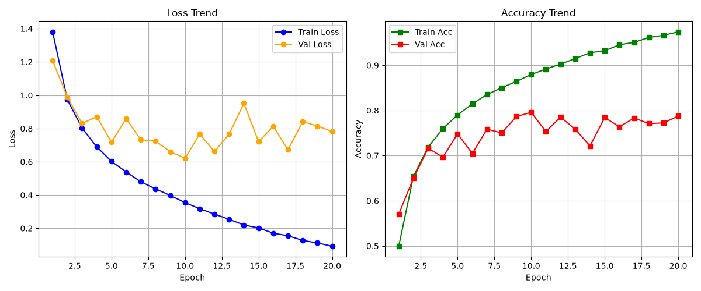
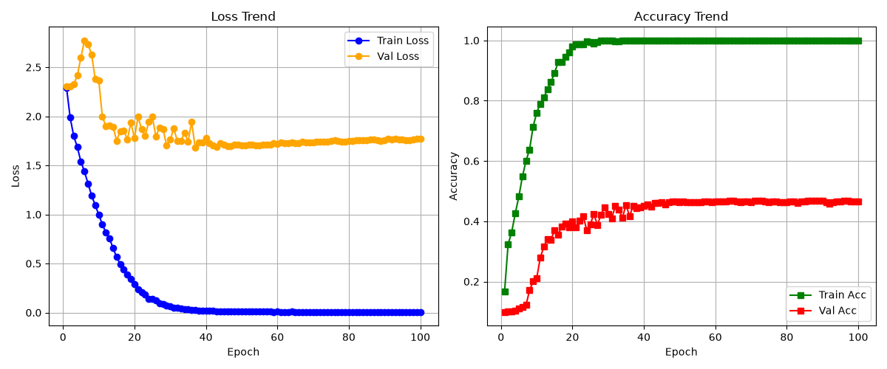

- 실험 노트.

> test set은 2026-XX-XX (Day 5)에 최초 1회만 열었습니다.
> 그 이전의 모든 판단은 val set만으로 내렸습니다.
## 1. 데이터 불러오기

### 1). 이미지 격자
- img / cifar10_samples.png


### 2). 정규화
> [결과]
> 유사한 값을 갖는다. 
> CIFAR10_MEAN = (0.4914, 0.4822, 0.4465)
> CIFAR10_STD  = (0.2470, 0.2435, 0.2616)
> 계산한 Mean : 0.4917, 0.4823, 0.4467
> 계산한 Std : 0.2471, 0.2435, 0.2616


### 3). DataLoader 


> [결과]
 x.shape : torch.Size([128, 3, 32, 32])
 x.dtype : torch.float32
 x.min   : -1.0000
 x.max   : 1.0000
 y[:10]  : tensor([4, 0, 7, 9, 7, 8, 5, 4, 8, 0])

---
## 2. 모델 구현

### 1). 차원 확인 및 width 변화에 따른 파라미터 수 측정
``` python
    print(">> width 16")
    model = SmallCNN(width=16)
    x = torch.randn(2, 3, 32, 32)
    print(model(x).shape)                                              # (2, 10) 이어야 함
    print(sum(p.numel() for p in model.parameters() if p.requires_grad))

    print(">> width 32")
    model = SmallCNN(width=32)
    x = torch.randn(2, 3, 32, 32)
    print(model(x).shape)                                              # (2, 10) 이어야 함
    print(sum(p.numel() for p in model.parameters() if p.requires_grad))

    print(">> width 64")
    model = SmallCNN(width=64)
    x = torch.randn(2, 3, 32, 32)
    print(model(x).shape)                                              # (2, 10) 이어야 함
    print(sum(p.numel() for p in model.parameters() if p.requires_grad))
```

> [결과]
>  1). width 16
	torch.Size([2, 10])
	73178
>2). width 32
	torch.Size([2, 10])
	289194
  3).width 64
	torch.Size([2, 10])
	1149770

| Width      | 파라미터 수  | 증가율 (width 16 기준) |
| ---------- | ------- | ----------------- |
| Width = 16 | 73178   | 1배                |
| Width = 32 | 289194  | 3.95배             |
| Width = 64 | 1149770 | 15.71배            |


### 2). 각 블록별 텐서 차원 변화

> [Block 1]
> 컨볼루션 층  : 입력 3 x 32 x 32 > 필터 C x 3 x 3 x 3 > 출력 C x 32 x 32
> 컨볼루션 층  : 입력 C x 32 x 32 > 필터 C x 3 x 3 x 3 > 출력 C x 32 x 32
> Max풀링 층  : 입력 C x 32 x 32 > 출력 C x 16 x 16
> (가중치 개수 : 27C + 9C^2)

> [Block 2]
> 컨볼루션 층  : 입력 C x 16 x 16 > 필터 2C x 3 x 3  x 3 > 출력 2C x 16 x 16
> 컨볼루션 층  : 입력 2C x 16 x 16 > 필터 2C x 3 x 3  x 3 > 출력 2C x 16 x 16
> Max풀링 층  : 입력 2C x 16 x 16 > 출력 2C x 8 x 8
> (가중치 개수 : 18C^2 + 36C^2)

> [Block 3]
> 컨볼루션 층  : 입력 2C x 8 x 8 > 필터 4C x 3 x 3  x 3 > 출력 4C x 8 x 8
> 컨볼루션 층  : 입력 4C x 8 x 8 > 필터 4C x 3 x 3  x 3 > 출력 4C x 8 x 8
> Max풀링 층  : 입력 4C x 8 x 8 > 출력 4C x 4 x 4
> (가중치 개수 : 72C^2 + 144C^2)

> [파라미터 수가 선형이 아닌 이유]
> Width를 C라 할때 컨볼루션 층의 파라미터 개수는 C^2이 지배적이므로 
> Width가 2배 커질 때 파라미터 개수는 4배씩 커진다.


---
## 3. 학습 루프 구현 

> [Hyperparameter]
> width 32
>  trainData 45,000 
>  valData 5,000
>  epochs 30
>  batch size 128
>  learning rate   0.005
>  weight_decay = 0.0
>  momentum = 0.9
>  dropout = 0




> Val accuracy는 최소 70% 이상 나온다.
> baseline 30 epoch이 5분 이내로 끝난다


---


## 4.  과적합 제조 실험

> [Hyperparameter]
>  trainData 500 
>  valData 5,000
>  epochs 100
>  batch size 128
>  width 64
>  learning rate  0.005 



> [ 분석 ]
> 1.100 epoch이 2분 안에 끝났다.
> 2.train accuracy가 100%에 도달하였다.
> 3.val accuracy는 훨씬 낮은 곳에서 정체 하였다
> 4.train loss가 0에 가깝게 떨어진다.
> 5.val loss가 epoch 37에서 1.6825로 최저점을 찍고 다시 올라간다.
> 6.val acc가 epoch 87, 96에서 0.4690으로 최고 점을 찍는다.
> 7.Loss를 기준으로 Best Epoch를 잡는 것이 과적합 시점을 잡는데 유용할 것으로 판단된다.

### 1). 왜  val loss와 val accuracy가 어긋나는가?
- CrossEntropy는 틀린 정도를 반영하지만 accuracy는 맞았는지만 반영한다.
- 학습 데이터 수가 적으므로 모델이 맞히던 건 계속 맞히면서 확신만 점점 세지고, 틀리는 것들은 높은 확신으로 틀리게 된다.
- CrossEntropy 손실 함수는 잘못된 예측에 강한 확률을 부여할 때 손실값을 아주 높게 부과하므로, 전체적인 val_loss는 위로 솟구치게 된다.


### 2). Early Stopping과 Checkpoint 직접 구현

- Accuracy의 경우, epoch이 증가함에 따라 높은 Cofidence를 가지고 맞히거나 틀리기 때문에 Loss를 기준으로 성능 평가를 하는 것이 맞다.
- 
- GPU 시간이 무한하다면, Patience를 아주 크게 잡고 끝까지 돌린 후, 가장 Best CheckPoint를 찾는 것이 좋다. Loss는 정체기에 있더라도 변동성이 있기 때문에 많은 반복을 통해 최선의 경우를 찾을 수 있다.
- 
- GPU 시간이 유한하다면, Patience를 작게 설정하여 일찍 멈추는 것이 좋다. 무의미한 과적합을 보는 것 보다 다른 하이퍼파라미터로 실험을 해보는 것이 더 유리하다.
- 

---

## 5. 실험 관리 도구
- Wandb Ai 툴
- [https://wandb.ai/rogong7428-kwangwoon-university/cifar10-onboarding/overview/details](https://wandb.ai/rogong7428-kwangwoon-university/cifar10-onboarding/overview)
---
## 6.  통제 실험

### 0). 실험 데이터


> [ baseline ]
	lr: 0.005             
	momentum: 0.9         
	weight_decay: 0.0    
	epochs: 30          
	dropout : 0.0        
	scheduler : "none"    
	augmentation : "none" 
	width: 32            
	batch_size: 128    
	seed: 42       
	train_num : 45000   
	val_num : 5000    

- early stop에 의해 소요 시간이 일관되지 않다.
- 아래 실험은 한 요소만 바꾸면서 진행하였다.

| #   | run 이름                                       | 바꾼 것                | best val acc | best<br>val<br>loss <br>epoch | 소요                   | 해석 (한 줄)                                                              |
| --- | -------------------------------------------- | ------------------- | ------------ | ----------------------------- | -------------------- | --------------------------------------------------------------------- |
| 0   | `base_w32_lr0.005_ep30`                      | baseline            | 80.1%        | 12                            | 99초<br>22ep종료        | 12 epoch부터 val loss 상승, 과적합 시작                                        |
| 1   | `train_tr500_w32_lr0.005`                    | train 500개          | 41.7%        | 19                            | 14.66초<br>29ep종료<br> | 19epoch 부터 val loss 상승, 과적합 시작                                        |
| 2   | `train_tr2000_w32_lr0.005`                   | train 2000개         | 50.8%        | 12                            | 14.68초<br>22ep<br>종료 | val loss의 변동성이 매우 심하다. 학습률이 커서 진동한다고 볼 수 있다.                          |
| 3   | `train_tr10000_w32_lr0.005`                  | train 10000개        | 63.1%        | 6                             | 22.59초<br>16ep종료     | 6 ep 이후 부터 val loss가 하락하지 못하고 과적합. 큰 학습률로 인한 진동 현상                    |
| 4   | `train_tr45000_w32_lr0.005`<br>(base)        | train 45000개        | 80.5%        | 14                            | 108.1초<br>24ep종료     | 12 ep 이후부터 과적합이 발생하여 val loss가 상승한다.                                  |
| 5   | `width_w16_lr0.005_ep30`                     | width 16            | 78.3%        | 19                            | 83초<br>29ep종료        | 19 ep이후 val loss 상승. 과적합.                                             |
| 6   | `width_w32_lr0.005_ep30`<br>(base)           | width 32            | 78.9%        | 12                            | 100초<br>22ep 종료      | val loss의 변동성이 크게 보인다. 12ep 이후 val loss 상승. 과적합.                      |
| 7   | `width_w64_lr0.005_ep30`                     | width 64            | 86.28%       | 22                            | 224.5초               | val loss의 변동성이 크게 보인다. 22ep 이후 val loss 미세한 상승. 과적합.                  |
| 8   | `augmentation_augnone_w_lr`<br>(base)        | aug none            | 79.6%        | 7                             | 76.6초<br>17ep종료      | val loss의 변동성이 크게 보인다. 7ep 이후 val loss  상승. 과적합.                      |
| 9   | `augmentation_augcrop_w_lr`                  | aug crop            | 83.32%       | 21                            | 137.6초               | 21ep 이후 val loss가 미세한 상승을 하나, 큰 변화는 없다.                               |
| 10  | `augmentation_augcrop_flip_w_lr`             | aug crop_flip       | 85.18%       | 29                            | 141초                 | 29ep에서 best loss를 기록하며 최적의 상황이 나왔다.                                   |
| 11  | `weightdecay_decay0.0_w32_lr0.005`<br>(base) | decay 0.0           | 79.42%       | 11                            | 93.6초<br>21ep종료      | 11ep 이후로 val loss가 크게 상승하여 1ep 수준으로 돌아왔다.                             |
| 12  | `weightdecay_decay1e-4_w32_lr0.005`<br>      | decay 1e-4          | 81.48%       | 15                            | 111.9초<br>25ep종료     | val loss가 큰 변동성을 보이고, 15ep 이후 val loss가 상승.                           |
| 13  | `weightdecay_decay5e-4_w32_lr0.005`<br>      | decay 5e-4          | 79.2%        | 9                             | 86.3초<br>19ep종료      | 9ep 이후 val loss가  크게 상승.                                              |
| 14  | `weightdecay_decay5e-3_w32_lr0.005`<br>      | decay 5e-3          | 79.1%        | 13                            | 103.8초23ep종료         | val loss의 변동성이 크게 보인다. 13ep 이후 val loss 크게 상승. 과적합.                   |
| 15  | `dropout_0.0_w32_lr0.005`                    | dropout<br>0.0      | 81.1%        | 15                            | 112.5초25ep종료         | val loss의 변동성이 크게 보인다. 15ep 이후 val loss 크게 상승. 과적합.                   |
| 16  | `dropout_0.3_w32_lr0.005`                    | dropout<br>0.3      | 79.6%        | 14                            | 109.3초24ep종료         | 14ep 이후 val loss가  크게 상승.                                             |
| 17  | `dropout_0.5_w32_lr0.005`                    | dropout<br>0.5      | 79.4%        | 9                             | 86.2초19ep종료          | 9ep 이후 val loss가 상승.                                                  |
| 18  | `lr_w32_lr0.5_ep30`                          | lr 0.5              | 79%          | 15                            | 113.4초25ep종료         | 15ep 이후 val loss가 미세한 상승.                                             |
| 19  | `lr_w32_lr0.05_ep30`                         | lr 0.05             | 83%          | 9                             | 88초19ep종료            | 9ep 이후 val loss가 크게 상승.                                               |
| 20  | `lr_w32_lr0.005_ep30`                        | lr 0.005            | 81.2%        | 14                            | 109.3초24ep종료         | 14ep 이후 val loss가 크게 상승.                                              |
| 21  | `lr_w32_lr0.0005_ep30`                       | lr 0.0005           | 76.1%        | 30                            | 138.9초               | 30 ep에서 best val loss를 기록하며 학습이 더 가능하다고 볼 수 있다.                       |
| 22  | `scheduler_none_w32_lr0.005`                 | scheduler <br>none  | 80.2%        | 7                             | 78.7초17ep종료          | 57ep 이후 val loss가 크게 변동.                                              |
| 23  | `scheduler_cosine_w32_lr0.005`               | scheduler<br>cosine | 82.8%        | 21                            | 135.8초               | 21ep 이후 val loss 미세하게 상승.최적의 학습 상황. 높은 val acc 를 기록한다.                |
| 24  | `batch_size_32_w32_lr0.005`                  | batch<br>32         | 83.1%        | 10                            | 147.5초20ep종료         | 10ep 이후 val loss가 상승.                                                 |
| 25  | `batch_size_128_w32_lr0.005`                 | batch<br>128        | 80.2%        | 7                             | 77.4초17ep종료          | 7ep 이후 val loss가  변동.                                                 |
| 26  | `batch_size_512_w32_lr0.005`                 | batch<br>512        | 76.6%        | 18                            | 122.1초28ep종료         | val loss의 변동성이 매우 크다. 18ep에서 best val loss를 기록.이후 val loss가  변동하며 상승. |
|     |                                              |                     |              |                               |                      |                                                                       |


### 1). train 데이터 수
- 어떤 차이가 있었는가?
- 값의 차이에 따른 결과를 보고 왜 그렇게 되는건지 분석 필요.

### 2). width
- 어떤 차이가 있었는가?
- 값의 차이에 따른 결과를 보고 왜 그렇게 되는건지 분석 필요.

### 3). augmentation
- 어떤 차이가 있었는가?
- 값의 차이에 따른 결과를 보고 왜 그렇게 되는건지 분석 필요.


### 4). weight decay
- 어떤 차이가 있었는가?
- 값의 차이에 따른 결과를 보고 왜 그렇게 되는건지 분석 필요.

### 5). dropout

- 어떤 차이가 있었는가?
- 값의 차이에 따른 결과를 보고 왜 그렇게 되는건지 분석 필요.
### 6). learning rate
- 어떤 차이가 있었는가?
- 값의 차이에 따른 결과를 보고 왜 그렇게 되는건지 분석 필요.

### 7). scheduler
- 어떤 차이가 있었는가?
- 값의 차이에 따른 결과를 보고 왜 그렇게 되는건지 분석 필요.

### 8). batch size
- 어떤 차이가 있었는가?
- 값의 차이에 따른 결과를 보고 왜 그렇게 되는건지 분석 필요.

## 3. 통제 실험 주요 관찰 포인트 및 해석 가이드

실험 후 `docs/06-experiments.md` 작성 시 각 항목별로 아래 포인트들을 관찰하고 해석 한 줄을 남겨보세요.

| **실험 항목**                           | **관찰해야 할 지점**                       | **예상되는 현상 및 한 줄 해석 예시**                                                     |
| ----------------------------------- | ----------------------------------- | --------------------------------------------------------------------------- |
| **1. Train 크기** (500 vs 45,000)     | Train-Val 간의 격차(Generalization Gap) | _"데이터 수가 늘수록 과적합(Gap)이 줄어들고 Val Loss 바닥 지점이 뒤로 밀림."_                        |
| **2. Model Width** (16 vs 64)       | 모델 용량(Capacity)에 따른 수렴 속도와 과적합      | _"Width가 클수록 표현력이 커져 Train Loss는 빠르게 0에 도달하나, 정규화 없이는 Val Loss가 더 빨리 상향함."_ |
| **3. Augmentation** (Crop/Flip)     | Train Acc의 상승 속도 및 Val Gap          | _"Data Augmentation 적용 시 Train Acc 상승은 더뎌지나 일반화 성능이 향상되어 Val Acc 최고점이 오름."_ |
| **4. Weight Decay** (0 vs 5e-3)     | 파라미터 규제 세기                          | _"Weight Decay가 너무 크면 모델이 अंडर피팅(Underfitting)되고, 적절하면 Overfitting을 지연시킴."_ |
| **5. Dropout** (0.0 vs 0.3)         | Feature 마스킹 효과                      | _"Head 직전 Dropout은 Augmentation 대비 효과가 제한적이었지만, Train-Val 간격 축소에 기여함."_     |
| **6. Learning Rate** (0.5 ~ 0.0005) | Loss 곡선의 발산/진동/완만한 하락               | _"LR이 너무 크면(0.5) Loss가 발산하거나 진동하며, 너무 작으면(0.0005) 100 epoch 내에 수렴하지 못함."_   |
| **7. Scheduler** (CosineAnnealing)  | 평평해진 Loss의 2차 하락                    | _"Loss가 평평해진 시점에 LR을 줄여주자 local minima 근처에서 한 번 더 떨어지며 성능 향상."_             |

---
## 7. 함정 체험

